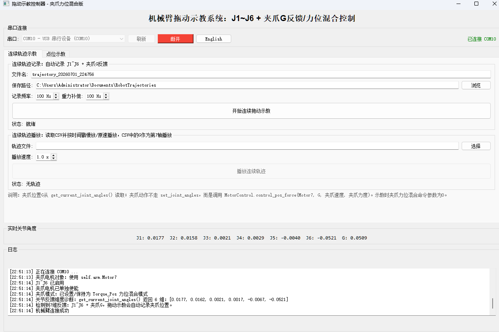
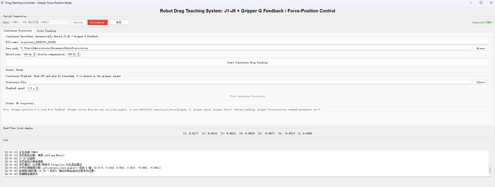
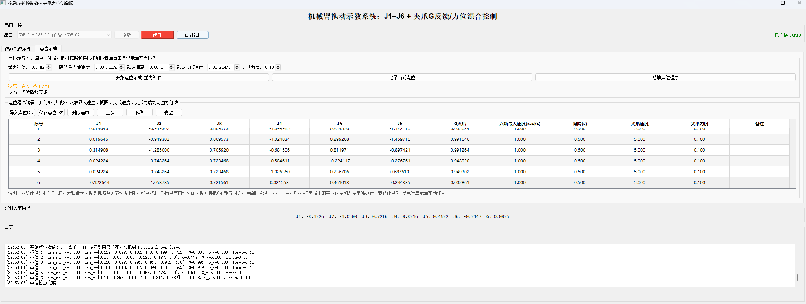
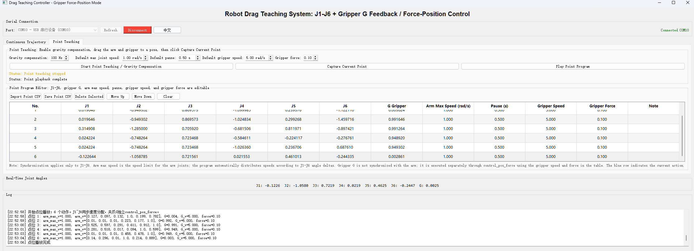
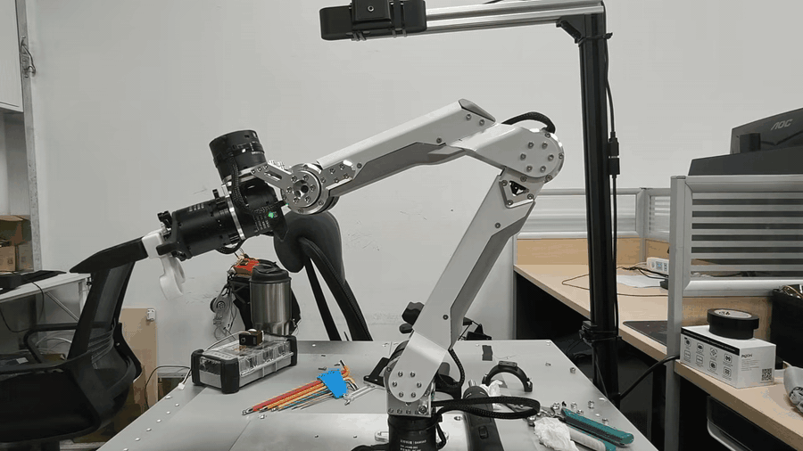

# 机械臂拖动示教系统：J1~J6 + 夹爪 G 反馈/力位混合控制

本目录是带夹爪反馈的拖动示教上位机程序，支持连续轨迹示教、连续轨迹回放、点位示教、点位 CSV 导入/导出、中英文界面切换，以及机械臂使能/失能和当前位置设置 0 点。

夹爪 G 不作为第 7 个关节塞进 `set_joint_angles()`，而是独立使用 `RobotCtrl.control_pos_force(gripper, position, velocity, force_limit)` 进行力位混合控制。J1~J6 仍走机械臂关节控制逻辑。

## 界面参考

### 连续轨迹示教





### 点位示教





### 操作演示 GIF



## 文件说明

- `main.py`
  PyQt5 主界面，负责串口选择、按钮、表格、语言切换和界面状态显示。
- `robot_worker.py`
  后台控制线程，集中访问机械臂、串口和 CAN，避免 UI 线程直接抢占硬件资源。
- `ArmDriver.py`
  机械臂驱动封装，提供 `RobotController`、电机对象和底层控制接口。
- `DM_CAN.py`
  达妙/达秒电机 CAN 通信相关代码。
- `trajectory_io.py`
  连续轨迹 CSV 读写，保存 `timestamp + J1~J6 + G + V1~V6 + VG`。
- `point_io.py`
  点位程序 CSV 读写，保存 `J1~J6 + G + 六轴最大速度 + 间隔 + 夹爪速度 + 夹爪力度 + 备注`。
- `filters.py`
  速度滤波辅助。
- `RobotKinematics.py`
  运动学相关代码。
- `requirements.txt`
  Python 依赖列表。

## 运行环境

- Python 3.7+
- Windows 或 Linux
- USB 转 CAN 适配器
- 机械臂 J1~J6 电机与夹爪电机已经正确接线和供电

安装依赖：

```bash
python -m pip install -r requirements.txt
```

等价安装方式：

```bash
python -m pip install pyqt5 pyserial
```

启动程序：

```bash
python main.py
```

## 连接设备

1. 打开程序后，在串口下拉框选择 USB 转 CAN 串口，例如 `COM10`。
2. 点击“刷新”可重新扫描串口。
3. 点击“连接”后，程序会创建 `RobotController(port=port, type="Grivity_arm")`。
4. 日志区出现“机械臂连接成功”后即可开始示教。
5. 右上角显示已连接串口；点击 `English` / `中文` 可切换界面语言。
6. 串口连接栏提供“使能/失能”和“设置0点”按钮，用于手动切换电机使能状态和重新标定机械臂 0 位。

## 设置机械臂 0 点

设置 0 点会把当前机械臂位置写为新的 0 位，设置后不可逆。执行前请确认机械臂已经摆到正确位置，且工作空间安全。

推荐操作流程：

1. 先选择串口并点击“连接”，连接机械臂。
2. 点击“失能”，让机械臂进入可手动摆动状态。
3. 手动把机械臂摆到需要作为 0 位的位置。
4. 点击“使能”，重新使能机械臂。
5. 点击“设置0点”。
6. 弹出确认框后，再次点击“确定”，上位机会将当前位置设置为 0 点。

注意事项：

- “设置0点”会弹出二次确认，只有点击“确定”后才会真正写入 0 位。
- 示教、播放、设 0 点执行过程中，“使能/失能”和“设置0点”按钮会临时禁用，避免多个硬件操作叠加。
- 机械臂处于失能状态时，需要先点击“使能”，再开始连续轨迹示教、点位示教或轨迹播放。

## 连续轨迹示教

连续轨迹用于完整记录人工拖动过程，并按时间戳回放。

### 记录连续轨迹

1. 进入“连续轨迹示教”页。
2. 设置文件名和保存路径，默认保存到用户文档目录下的 `RobotTrajectories`。
3. 设置记录频率，范围会限制在 `10 Hz ~ 200 Hz`。
4. 设置重力补偿频率，范围会限制在 `20 Hz ~ 500 Hz`。
5. 点击“开始连续拖动示教”。
6. 手动拖动 J1~J6 和夹爪 G。
7. 再次点击停止后，程序会自动保存 CSV。

连续轨迹 CSV 字段：

```text
timestamp,j1,j2,j3,j4,j5,j6,g,v1,v2,v3,v4,v5,v6,vg
```

其中：

- `timestamp`：采样时间。
- `j1` ~ `j6`：六轴关节角。
- `g`：夹爪 G 反馈位置。
- `v1` ~ `v6`：六轴速度。
- `vg`：夹爪速度。

### 播放连续轨迹

1. 在“连续轨迹播放”区域点击“选择”，导入轨迹 CSV。
2. 设置播放速度，范围为 `0.1x ~ 1.0x`。
3. 点击“播放连续轨迹”。
4. J1~J6 通过 `set_joint_angles()` 播放；夹爪 G 通过 `control_pos_force()` 单独播放。

连续轨迹播放时，夹爪默认使用：

```text
夹爪速度: 5.0
夹爪力度: 0.1
```

## 点位示教

点位示教用于把机械臂拖到若干关键姿态，记录成点位程序，然后按顺序播放。

### 记录点位

1. 进入“点位示教”页。
2. 设置重力补偿频率。
3. 设置默认六轴最大速度，默认 `1.00 rad/s`。
4. 设置默认间隔，默认 `0.50 s`。
5. 设置默认夹爪速度，默认 `5.00 rad/s`。
6. 设置夹爪力度，默认 `0.10`。
7. 点击“开始点位示教/重力补偿”。
8. 手动拖动机械臂和夹爪到目标位置。
9. 点击“记录当前点位”，当前 `J1~J6 + G` 会写入表格。
10. 重复拖动和记录，形成完整点位程序。

### 编辑点位表格

表格字段含义：

- `J1` ~ `J6`：六轴目标关节角。
- `G夹爪`：夹爪目标位置。
- `六轴最大速度(rad/s)`：J1~J6 同步速度分配的速度上限。
- `间隔(s)`：该点动作完成后的等待时间。
- `夹爪速度`：夹爪单独执行 `control_pos_force()` 时的速度。
- `夹爪力度`：夹爪单独执行 `control_pos_force()` 时的力度限制。
- `备注`：人工说明，不参与控制。

### 播放点位程序

1. 确认点位表格无误。
2. 点击“播放点位程序”。
3. 程序会按表格顺序执行每一行。
4. 蓝色行表示当前正在执行的点位。
5. 播放完成后日志区会提示“点位播放完成”。

点位播放逻辑：

- J1~J6 会根据角度差自动分配速度，尽量同步到达。
- 夹爪 G 不参与六轴同步计算。
- 夹爪按该行的夹爪速度和夹爪力度单独执行 `control_pos_force()`。

### 导入和保存点位 CSV

点位程序可点击“保存点位CSV”导出，也可点击“导入点位CSV”复用。

新版点位 CSV 字段：

```text
index,j1,j2,j3,j4,j5,j6,g,max_arm_speed_rad_s,pause_s,gripper_speed_rad_s,gripper_force_limit,note
```

程序也兼容旧版点位 CSV：

- `index + J1~J6 + G + max_speed + pause + gripper_force + note`
- `index + J1~J6 + max_speed + pause + gripper_position + gripper_velocity + gripper_force + note`
- `index + J1~J6 + speed + pause + note`

## 夹爪控制逻辑

夹爪电机优先从 `ArmDriver.RobotController` 中寻找以下对象：

```text
Motor7
motor7
gripper
Gripper
gripper_motor
```

推荐在 `ArmDriver.py` 中定义：

```python
self.Motor7 = Motor(DM_Motor_Type.DM4310, 0x07, 0x17)
self.gripper = self.Motor7
```

播放夹爪动作时调用：

```python
self.arm.RobotCtrl.control_pos_force(
    self.arm.gripper,
    gripper_position,
    gripper_velocity,
    force_limit,
)
```

示教阶段会周期性发送夹爪力位混合零命令：

```text
position = 0
velocity = 0
force_limit = 0
```

这样可以保持夹爪在力位混合相关模式下，同时从反馈中记录 G 位置。

## 安全退出和回零

点击“断开”或关闭窗口时，程序会尝试执行安全退出流程：

1. 停止当前连续轨迹或点位任务。
2. J1~J6 切换到位置速度模式。
3. J1~J6 自动回到零位。
4. 失能电机并关闭串口。

默认回零参数位于 `robot_worker.py`：

```python
self.home_target = [0.0] * ARM_DOF
self.home_speed = 1.0
self.home_tolerance = 0.03
self.home_timeout = 12.0
```

夹爪不参与自动回零，避免夹持物体时误闭合或误张开。

## 常见问题

### 只能读到 J1~J6，G 不变化

请确认 `ArmDriver.py` 是否提供夹爪反馈接口。程序会依次尝试：

```text
get_current_gripper_angles
get_current_gripper_angle
get_gripper_position
read_gripper_position
get_gripper_angle
```

如果底层驱动没有这些接口，建议在 `get_current_joint_angles()` 末尾直接返回夹爪 G，形成 `J1~J6 + G` 七维列表。

### 夹爪不动作

请检查：

- `ArmDriver.py` 中是否存在 `self.RobotCtrl` 或 `self.MotorControl`。
- 控制对象是否提供 `control_pos_force()`。
- `self.Motor7` 或 `self.gripper` 是否正确指向夹爪电机。
- 夹爪电机 ID 是否为 `0x07, 0x17`，如硬件不同需同步修改。

### 点位播放速度不符合预期

点位表格里的“六轴最大速度”只控制 J1~J6。夹爪 G 使用“夹爪速度”字段独立执行，不参与六轴同步分配。
